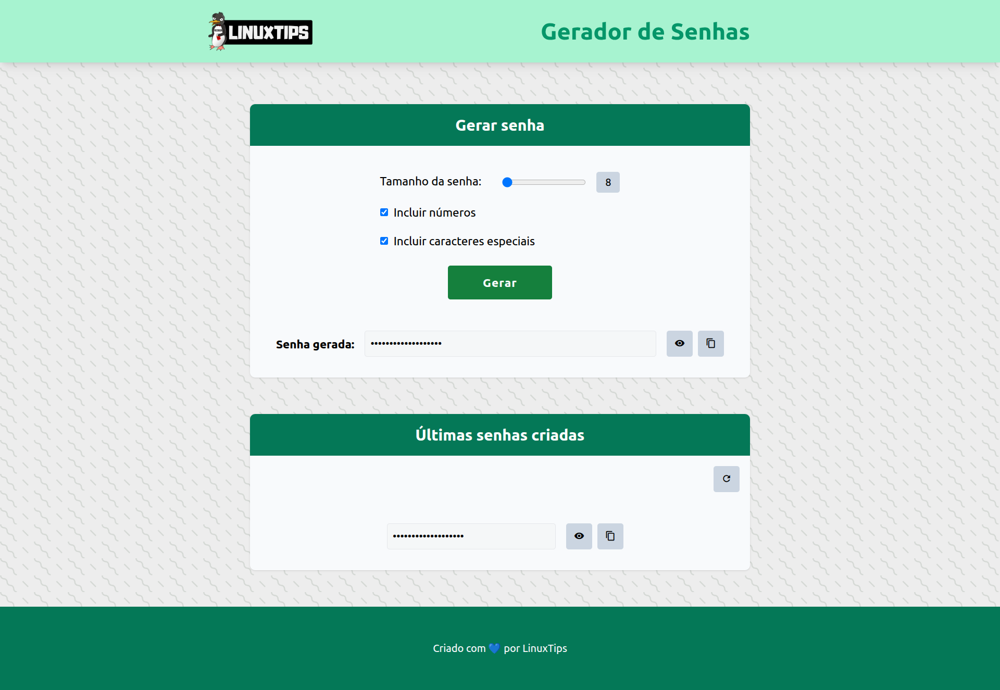

# 🔐 Giropops Senhas

Aplicação para geração de **senhas únicas, fortes e randômicas** desenvolvida em Python pela @linuxtips.

Projeto de containers criado durante o treinamento **PICK 2026** da @linuxtips, com foco em conteinerização, boas práticas de build e uso de imagens seguras, ministrado por @badtuxx.
A Aplicação sem si foi desenvolvida pela @linuxtips em outro momento.

---

# 📦 Stack Tecnológica

- **Python** → Lógica de geração de senhas
- **Redis** → Armazenamento temporário
- **Docker** → Conteinerização
- **Docker Compose** → Orquestração local
- **Distroless** → Hardening de imagem

---

# 🏗️ Arquitetura

```
[ Usuário ]
     ↓
[ App Python ]
     ↓
[ Redis (Distroless) ]
```

- O App gera senhas seguras.
- O Redis armazena dados temporários.
- Tudo roda isolado via containers.

---

# 📂 Estrutura do Projeto

```bash
.
├── app/                  # Código da aplicação Python
├── redis/                # Dockerfile customizado do Redis
├── docker-compose.yml   # Orquestração dos serviços
├── requirements.txt
└── README.md
```

---

# 🚀 Como executar o projeto

## 1) Clonar o repositório

```bash
git clone https://github.com/pcostamiguez/giropops-senhas.git
cd giropops-senhas
```

---

## 2) Build das imagens

### App

```bash
docker build -t giropops-senhas:1.0 .
```

### Redis (Distroless)

```bash
docker build -t giropops-redis:1.0 redis/
```

---

## 3) Subir os containers

```bash
docker compose up -d
```

Verificar:

```bash
docker compose ps
```

---

## 4) Parar o ambiente

```bash
docker compose down -v
```

- Remove containers
- Remove rede
- Remove volumes

---

# 🛡️ Hardening e Segurança

Medidas implementadas:

- Uso de imagem **Distroless**
- Redução de superfície de ataque
- Sem shell interativo
- Menor número de pacotes

Benefícios:

- Menos CVEs
- Imagem menor
- Maior segurança em runtime

## Verificação de vulnerabilidades nas imagens:

### Trivy:

```md
trivy image giropops-senhas:1.0
```

```md
trivy image giropops-redis:1.0
```

### Docker Scout

```md
docker scout cves giropops-senhas:1.0
```

```md
docker scout cves giropops-redis:1.0
```

---

# 📸 Screenshot

Aplicação em execução:

```md

```

---

# 📊 Observabilidade

Comandos úteis:

```bash
docker container stats

docker container logs -f giropops-senhas
```

---

# 💻 Autor

Projeto desenvolvido durante o **PICK 2026** — @linuxtips - @badtuxx.


